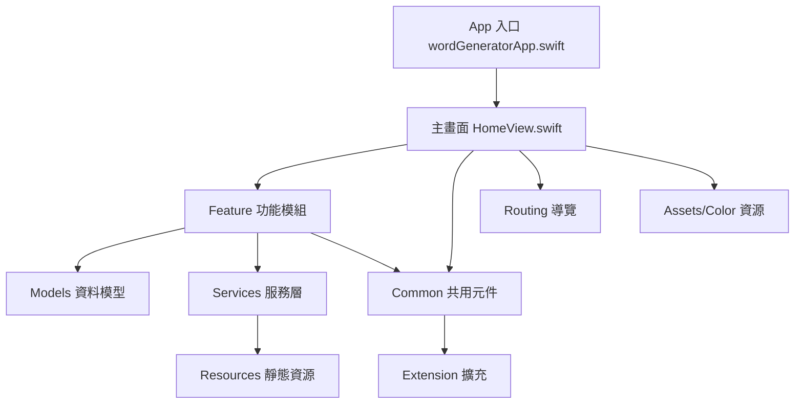

# Word Generator

這是一個使用 Swift 開發的單詞生成器 iOS 應用程式，支援多種單詞遊戲模式與自定義規則。

## 開發工具使用比例

本專案使用以下工具進行開發：

- 80% 使用 [Cursor](https://cursor.sh/) - 主要用於代碼生成、重構和自動完成
- 10% 使用 ChatGPT - 用於解決特定問題和提供建議
- 10% 手動修改 - 用於微調和優化代碼

## 功能特點

- 生成隨機單詞與成語
- 多種遊戲模式（一般模式、成語填空、遊戲模式等）
- 自定義單詞生成規則
- 用戶友好的介面

## 系統需求

- iOS 15.0 或更高版本
- Xcode 13.0 或更高版本
- Swift 5.0 或更高版本

## 安裝說明

1. 克隆此專案到本地：

```bash
git clone [repository-url]
```

2. 使用 Xcode 開啟 `wordGenerator.xcodeproj`
3. 選擇目標設備或模擬器
4. 點擊運行按鈕或使用快捷鍵 `Cmd + R` 執行應用程式

## 專案結構

```
wordGenerator/
├── wordGenerator.xcodeproj/         # Xcode 專案檔
├── wordGenerator/                   # 主要程式碼目錄
│   ├── Models/                      # 資料模型（如單詞、成語）
│   ├── Services/                    # 服務層（如單詞管理）
│   ├── Feature/                     # 功能模組（一般、遊戲、成語填空）
│   ├── Common/                      # 共用元件（自訂按鈕、SegmentControl）
│   ├── Extension/                   # Swift 擴充
│   ├── Routing/                     # 導覽與路由
│   ├── Resources/                   # 靜態資源（如 idioms.json, simple.json）
│   ├── Assets.xcassets/             # 圖片資源
│   ├── Color.xcassets/              # 顏色資源
│   ├── Preview Content/             # 預覽內容
│   ├── HomeView.swift               # 主畫面
│   ├── wordGeneratorApp.swift       # App 入口
│   └── Info.plist                   # 設定檔
└── .gitignore
```

### 架構圖



## 主要技術/工具

- [Cursor](https://cursor.sh/) - AI 輔助開發工具
- Xcode - Apple 官方開發環境
- Swift - 主要開發語言
- ChatGPT - 用於解決特定編程問題

## 貢獻指南

歡迎提交 Pull Request 或提出 Issue。

## 授權

[MIT License](LICENSE)
